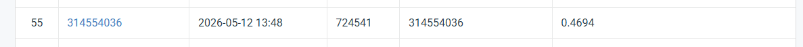

# NYCU Computer Vision 2026 HW3

- **Student ID:** 314554036
- **Name:** 郭彥頡, Yenchieh Kuo

## Introduction
This project aims to develop a robust instance segmentation model for medical cells. Because medical images have extremely dense cell distributions and staining artifacts, we optimized a **Mask R-CNN (ResNet-101-FPN)** model. 
To achieve high accuracy and avoid Overfitting/OOM issues, we implemented several key modifications:
- **Attention Mechanism:** Injected CBAM (Convolutional Block Attention Module) into the backbone (`layer4`).
- **Data Augmentation:** Applied spatial augmentations (Random Flips & Rotations), Color Jitter, and Multi-Scale Training.
- **Hybrid Loss:** Overwrote the default mask loss with a Weighted Dice Loss to refine boundary prediction.
- **Inference Optimization:** Designed a memory-efficient 6-View Test-Time Augmentation (TTA) combining Weighted Boxes Fusion (WBF) and a custom Soft Mask Merge strategy.

## Environment Setup
It is recommended to run this project in a virtual environment. The code is tested on Linux with an RTX 4090 GPU (24GB VRAM).

To install the required dependencies, run:
```bash
pip install -r requirements.txt

## Usage
### Training
How to train your model.
```bash
python train.py
```
### Inference
How to run inference.
```bash
python inference.py
```

## Performance Snapshot

```
